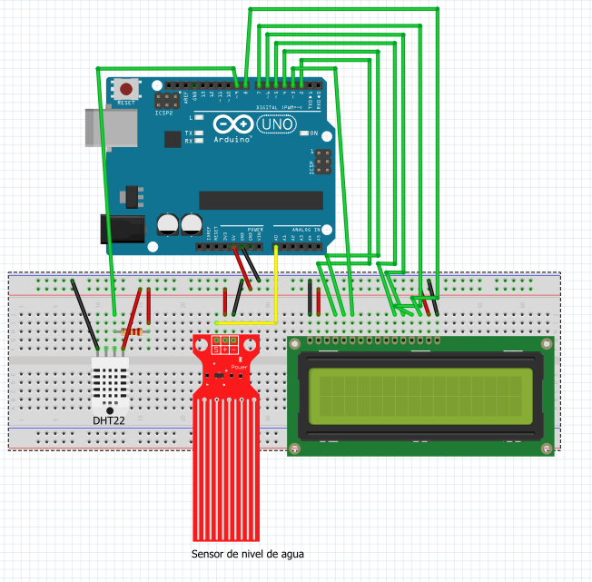

# Ambiental Condition Sensor

This projects has as primary function, get the value of ambient conditions like water level, humidity and temperature in a room.
when one of the values is out from the standard values, the device send an email alert.

I made it during my internship and is composed for two parts:

## The sensors

This part is composed by one humidity and temperature sensor,Like the DHT22, a water level sensor and an arduino.

The arduino get all the data from the sensors and compare with standars values, if detects values out of the normal range send an alert using serial comunication.

Circuit of the arduino with the sensors and a lcd display

## The Computer.

For testing, this part was made  using a PC, but, if this projectc is implemented, the ideal is use a raspberry pi, or iot devices to send the data.

In the case that we use a raspberry pi, we need the python script in this repo.